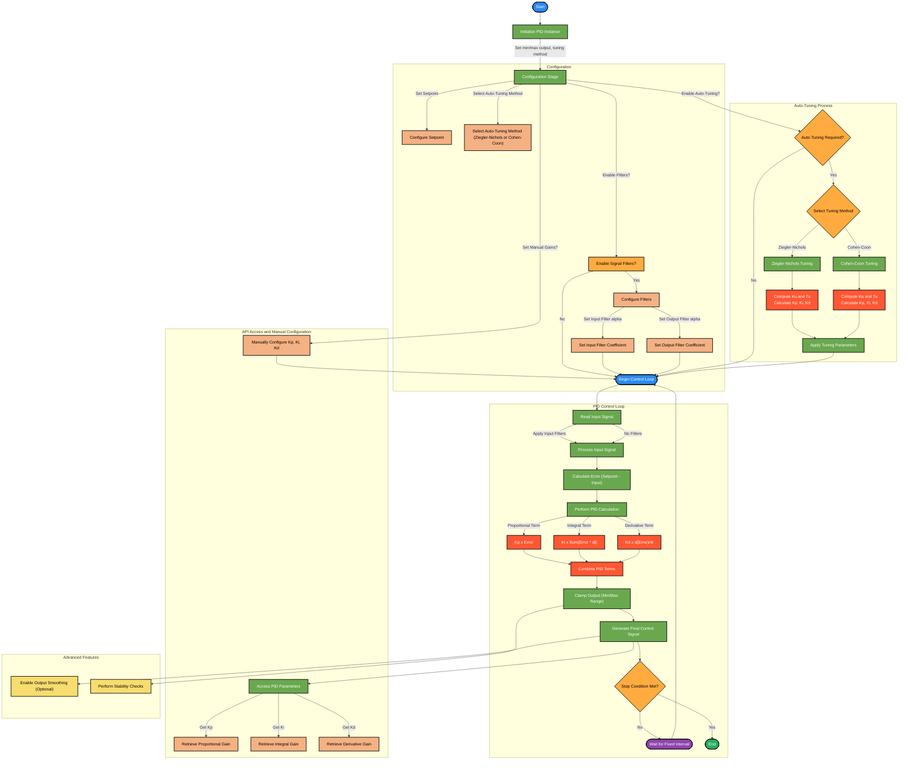

```mermaid
flowchart TD
    %% Start of the flowchart with enhanced visuals
    Start(["Start"]):::start --> Init["Initialize PID Instance"]:::process
    Init -->|Set min/max output, tuning method| Config["Configuration Stage"]:::process

    %% Configuration stage
    subgraph Configuration["Configuration"]
        Config -->|Set Setpoint| SetSetpoint["Configure Setpoint"]:::setting
        Config -->|Select Auto-Tuning Method| TuningMethod["Select Auto-Tuning Method (Ziegler-Nichols or Cohen-Coon)"]:::setting
        Config -->|Enable Filters?| Filters["Enable Signal Filters?"]:::decision

        Filters -->|Yes| FilterConfig["Configure Filters"]:::setting
        Filters -->|No| LoopStart(["Begin Control Loop"]):::start

        FilterConfig -->|Set Input Filter alpha| SetInputFilter["Set Input Filter Coefficient"]:::setting
        FilterConfig -->|Set Output Filter alpha| SetOutputFilter["Set Output Filter Coefficient"]:::setting
        SetInputFilter --> LoopStart
        SetOutputFilter --> LoopStart
    end

    %% PID Control Loop
    subgraph PID_Control["PID Control Loop"]
        LoopStart --> Input["Read Input Signal"]:::process
        Input -->|Apply Input Filters| FilteredInput["Process Input Signal"]:::process
        Input -->|No Filters| FilteredInput
        FilteredInput --> ComputeError["Calculate Error (Setpoint - Input)"]:::process
        ComputeError --> PIDUpdate["Perform PID Calculation"]:::process

        %% Detailed PID Components
        PIDUpdate -->|Proportional Term| Proportional["Kp x Error"]:::calculation
        PIDUpdate -->|Integral Term| Integral["Ki x Sum(Error * dt)"]:::calculation
        PIDUpdate -->|Derivative Term| Derivative["Kd x d(Error)/dt"]:::calculation

        Proportional --> ComputePID["Combine PID Terms"]:::calculation
        Integral --> ComputePID
        Derivative --> ComputePID

        ComputePID --> ClampOutput["Clamp Output (Min/Max Range)"]:::process
        ClampOutput --> GenerateOutput["Generate Final Control Signal"]:::process
        GenerateOutput --> EndCondition{"Stop Condition Met?"}:::decision
        EndCondition -->|No| Wait(["Wait for Fixed Interval"]):::waiting
        Wait --> LoopStart
        EndCondition -->|Yes| Finished(["End"]):::flowend
    end

    %% Auto-Tuning Process
    subgraph AutoTuning["Auto-Tuning Process"]
        Config -->|Enable Auto-Tuning?| AutoTuningStart{"Auto-Tuning Required?"}:::decision
        AutoTuningStart -->|Yes| TuningStart{"Select Tuning Method"}:::decision
        AutoTuningStart -->|No| LoopStart

        TuningStart -->|Ziegler-Nichols| ZNTune["Ziegler-Nichols Tuning"]:::process
        ZNTune --> ZNCompute["Compute Ku and Tu<br>Calculate Kp, Ki, Kd"]:::calculation
        ZNCompute --> ApplyTuning["Apply Tuning Parameters"]:::process

        TuningStart -->|Cohen-Coon| CCTune["Cohen-Coon Tuning"]:::process
        CCTune --> CCCompute["Compute Ku and Tu<br>Calculate Kp, Ki, Kd"]:::calculation
        CCCompute --> ApplyTuning

        ApplyTuning --> LoopStart
    end

    %% API Access and Manual Configuration
    subgraph API_Access["API Access and Manual Configuration"]
        Config -->|Set Manual Gains?| ManualGains["Manually Configure Kp, Ki, Kd"]:::setting
        ManualGains --> LoopStart

        GenerateOutput --> AccessParameters["Access PID Parameters"]:::process
        AccessParameters -->|Get Kp| GetKp["Retrieve Proportional Gain"]:::setting
        AccessParameters -->|Get Ki| GetKi["Retrieve Integral Gain"]:::setting
        AccessParameters -->|Get Kd| GetKd["Retrieve Derivative Gain"]:::setting
    end

    %% Advanced Features
    subgraph Advanced_Features["Advanced Features"]
        GenerateOutput --> OutputSmoothing["Enable Output Smoothing (Optional)"]:::optional
        ClampOutput --> StabilityChecks["Perform Stability Checks"]:::optional
    end

    %% Define styles
    classDef start fill:#2d89ef,stroke:#000,stroke-width:2px,color:#fff;
    classDef process fill:#6aa84f,stroke:#000,stroke-width:2px,color:#fff;
    classDef setting fill:#f4b183,stroke:#000,stroke-width:2px,color:#000;
    classDef decision fill:#ffab40,stroke:#000,stroke-width:2px,color:#000;
    classDef calculation fill:#ff5733,stroke:#000,stroke-width:2px,color:#fff;
    classDef waiting fill:#8e44ad,stroke:#000,stroke-width:2px,color:#fff;
    classDef flowend fill:#27ae60,stroke:#000,stroke-width:2px,color:#fff;
    classDef optional fill:#f7dc6f,stroke:#000,stroke-width:2px,color:#000;
```
